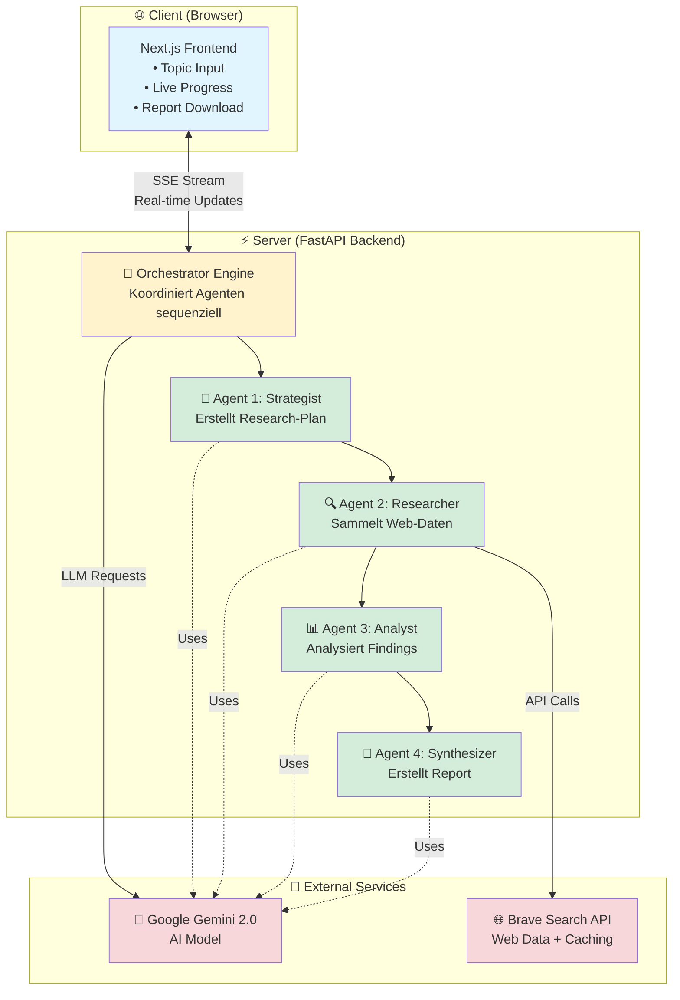
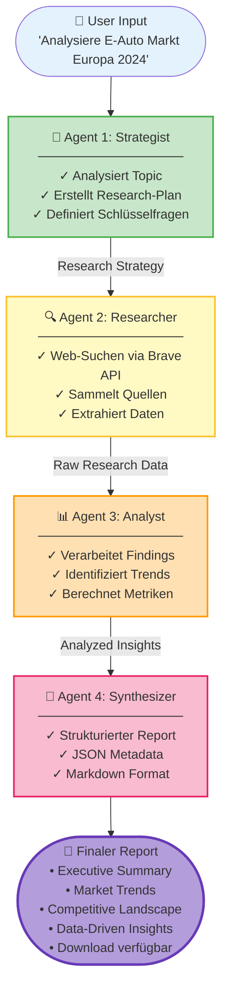
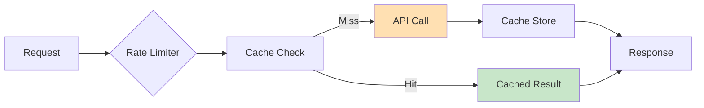
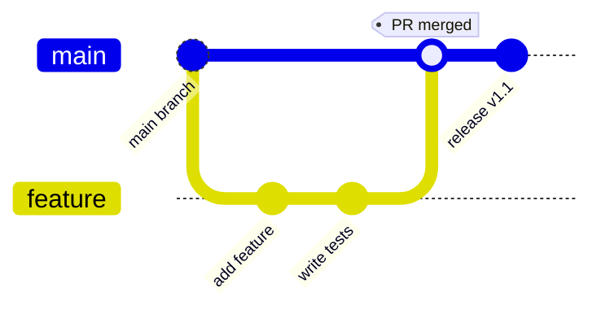

<div align="center">

# 🔬 Market Analyst AI

### Autonomes Multi-Agenten Research System

*Gib ein Thema ein → Erhalte einen professionellen Research-Report mit Echtzeit-Webdaten*

[](https://github.com/yourusername/market-analyst-ai/releases)
[](https://www.python.org/)
[](https://nextjs.org/)
[](https://fastapi.tiangolo.com/)
[](LICENSE)
[](http://makeapullrequest.com)

<!-- Uncomment when you have CI/CD setup -->
<!-- [](https://github.com/yourusername/market-analyst-ai/actions) -->
<!-- [](https://codecov.io/gh/yourusername/market-analyst-ai) -->

[🚀 Demo](https://market-analyst-demo.vercel.app) • [📖 Dokumentation](./docs/1.%20Project%20Overview.md) • [🐛 Issues](https://github.com/yourusername/market-analyst-ai/issues) • [💬 Discussions](https://github.com/yourusername/market-analyst-ai/discussions)

---

<!-- Uncomment when you have screenshots ready -->
<!--  -->

### Schnell-Deploy

[](https://vercel.com/new/clone?repository-url=https%3A%2F%2Fgithub.com%2Fyourusername%2Fmarket-analyst-ai&env=GOOGLE_API_KEY,BRAVE_SEARCH_API_KEY&envDescription=API%20Keys%20required%20for%20the%20application&envLink=https%3A%2F%2Fgithub.com%2Fyourusername%2Fmarket-analyst-ai%23configuration)
[](https://railway.app/template/market-analyst-ai)

<!--  -->

</div>

---

## 📑 Inhaltsverzeichnis

- [🎯 Überblick](#-überblick)
- [🏗️ Wie es funktioniert](#️-wie-es-funktioniert)
- [🎬 Features in Action](#-features-in-action)
- [💼 Use Cases](#-use-cases)
- [🚀 Schnellstart](#-schnellstart)
- [🛠️ Tech Stack](#️-tech-stack)
- [⚙️ Konfiguration](#️-konfiguration)
- [📡 API Referenz](#-api-referenz)
- [⚡ Performance & Skalierung](#-performance--skalierung)
- [🗺️ Roadmap](#️-roadmap)
- [❓ FAQ](#-faq)
- [👥 Contributing](#-contributing)
- [📄 Lizenz](#-lizenz)

---

## 🎯 Überblick

Ein vollautomatisches Research-System, das **4 spezialisierte KI-Agenten** orchestriert, um tiefgehende Marktanalysen zu erstellen. Von der ersten Strategieplanung bis zum fertigen Report – alles in Echtzeit verfolgbar.

### ✨ Hauptfeatures

```
🤖 4-Agenten Pipeline    │ Strategist → Researcher → Analyst → Synthesizer
⚡ Live Updates          │ Echtzeit-Progress via Server-Sent Events (SSE)
🌐 Echte Web-Suche      │ Brave Search API mit intelligentem Caching
📊 Professionelle Reports│ JSON Metadata + Markdown mit Download-Funktion
```

---

## 🏗️ Wie es funktioniert

### Systemarchitektur



### 🔄 Die 4-Agenten Pipeline (Schritt für Schritt)



**Durchlaufzeit:** ~2-5 Minuten je nach Topic-Komplexität • **Echtzeit-Updates:** Jeder Schritt sendet Progress via SSE

---

## 🎬 Features in Action

<table>
<tr>
<td width="50%">

### Real-time Progress Tracking
Verfolge jeden Agenten live – von der ersten Strategieplanung bis zum fertigen Report.

<!--  -->

**Features:**
- 🔴 Live Status Updates
- 📊 Progress Bars pro Agent
- 📝 Detailed Logs
- ⏱️ Time Estimates

</td>
<td width="50%">

### Professional Reports
Strukturierte, downloadbare Reports mit Markdown-Formatierung und Metadaten.

<!--  -->

**Includes:**
- 📄 Executive Summary
- 📈 Data Visualizations
- 🔗 Source References
- 💾 One-Click Download

</td>
</tr>
</table>

---

## 💼 Use Cases

<details>
<summary><b>🏢 Market Research</b></summary>

Tiefgehende Marktanalysen für:
- Neue Märkte erschließen
- Wettbewerber analysieren
- Markttrends identifizieren
- TAM/SAM/SOM Sizing

**Beispiel Topics:**
- "Electric vehicle market in Europe 2024"
- "SaaS startup landscape in DACH region"
- "AI adoption in healthcare industry"

</details>

<details>
<summary><b>🎓 Academic Research</b></summary>

Schnelle Research-Basis für:
- Literature Reviews
- Trend Analysis
- Data Collection
- Source Discovery

**Beispiel Topics:**
- "Recent developments in quantum computing"
- "Climate change impact studies 2024"
- "Machine learning in drug discovery"

</details>

<details>
<summary><b>📊 Business Intelligence</b></summary>

Kompetitive Insights für:
- Strategic Planning
- Product Development
- Investment Decisions
- Partner Research

**Beispiel Topics:**
- "Top fintech startups in Southeast Asia"
- "Emerging technologies in logistics"
- "Sustainability trends in manufacturing"

</details>

<details>
<summary><b>💡 Content Creation</b></summary>

Research-Foundation für:
- Blog Posts & Articles
- Whitepapers
- Reports & Presentations
- Social Media Content

**Beispiel Topics:**
- "Future of remote work 2025"
- "Cybersecurity best practices"
- "Digital transformation case studies"

</details>

---

## 📸 Beispiel-Workflow

### 1️⃣ Topic eingeben
```
User tippt: "Analyze the future of renewable energy in Germany"
           │
           ▼
[Strategist startet automatisch...]
```

### 2️⃣ Live Progress verfolgen
```
⏳ Strategist   ████████████████ 100%  ✓ Strategy ready
⏳ Researcher   ████████░░░░░░░░  60%  🔍 Searching sources...
⏸  Analyst     ░░░░░░░░░░░░░░░░   0%  ⏳ Waiting...
⏸  Synthesizer ░░░░░░░░░░░░░░░░   0%  ⏳ Waiting...
```

### 3️⃣ Report ansehen & downloaden
```
✅ Report komplett!

[Download Markdown] [Copy to Clipboard] [Share Link]

Preview:
┌────────────────────────────────────────┐
│ # Renewable Energy Market Analysis    │
│                                        │
│ ## Executive Summary                   │
│ The German renewable energy market...  │
│                                        │
│ ## Key Findings                        │
│ • Solar capacity: +23% YoY            │
│ • Wind installations: 45 GW total     │
│ ...                                    │
└────────────────────────────────────────┘
```

---

## 🚀 Schnellstart

### 📋 Voraussetzungen

| Komponente | Version | Erforderlich |
|------------|---------|--------------|
| 🐍 Python | 3.9+ | ✅ Ja |
| 📦 Node.js | 18+ | ✅ Ja |
| 🔑 Google Gemini API Key | - | ✅ Ja |
| 🔍 Brave Search API Key | - | ⚠️ Optional (Mock-Daten als Fallback) |

### ⚡ Installation in 3 Schritten

<details open>
<summary><b>🔧 Schritt 1: Backend Setup (Python)</b></summary>

```bash
cd backend

# Virtual Environment erstellen
python -m venv venv
source venv/bin/activate  # Windows: venv\Scripts\activate

# Dependencies installieren
pip install -r requirements.txt

# Konfiguration
cp .env.example .env
# ✏️ Öffne .env und füge deine API Keys ein:
#    GOOGLE_API_KEY=dein-key-hier
#    BRAVE_SEARCH_API_KEY=optional-brave-key
```

</details>

<details open>
<summary><b>🎨 Schritt 2: Frontend Setup (Next.js)</b></summary>

```bash
cd frontend

# Dependencies installieren
npm install

# Environment (optional)
cp .env.local.example .env.local
# Default Backend URL: http://localhost:8000
```

</details>

<details open>
<summary><b>🚀 Schritt 3: Starten & Loslegen</b></summary>

**Terminal 1 - Backend starten:**
```bash
cd backend
python simple_agent.py
# ✓ Server läuft auf http://localhost:8000
```

**Terminal 2 - Frontend starten:**
```bash
cd frontend
npm run dev
# ✓ App läuft auf http://localhost:3000
```

**🎉 Fertig!** Öffne [http://localhost:3000](http://localhost:3000) in deinem Browser.

</details>

### 🐳 Alternative: Docker (Production-Ready)

Komplett isoliertes Setup mit einem Befehl:

```bash
# Environment konfigurieren
cp .env.example .env
nano .env  # API Keys eintragen

# Starten (baut & startet beide Container)
docker-compose up -d

# ✓ Frontend: http://localhost:3000
# ✓ Backend:  http://localhost:8000

# Logs ansehen
docker-compose logs -f

# Stoppen
docker-compose down
```

---

## 🛠️ Tech Stack

<table>
<tr>
<td align="center" width="50%">

**Backend**
```
🐍 Python 3.9+
🚀 FastAPI (async)
🤖 Google Gemini 2.0 Flash
🔍 Brave Search API
📊 Server-Sent Events (SSE)
🧪 Pytest
```

</td>
<td align="center" width="50%">

**Frontend**
```
⚛️  Next.js 14 (App Router)
📘 TypeScript
🎨 Tailwind CSS
🔄 Real-time SSE Client
🎯 React Hooks
📦 Modern ES Modules
```

</td>
</tr>
</table>

<div align="center">

**Deployment**: Docker • Docker Compose • CI/CD GitHub Actions

</div>

---

## 🧪 Testing & Quality

```bash
# Backend Tests (Pytest mit Coverage)
cd backend
pytest tests/ -v --cov=.

# Frontend Type Safety
cd frontend
npm run build  # Inkludiert TypeScript Type Checking
```

---

## ⚙️ Konfiguration

### Backend Environment Variables (`backend/.env`)

```bash
# ✅ Erforderlich
GOOGLE_API_KEY=your-gemini-api-key-here

# ⚠️ Optional (empfohlen für echte Web-Suche)
BRAVE_SEARCH_API_KEY=your-brave-api-key-here

# 🔧 Server Configuration
PORT=8000                           # Backend Port
GEMINI_MODEL=gemini-2.0-flash       # AI Model
ENVIRONMENT=development              # development | production
LOG_LEVEL=INFO                      # DEBUG | INFO | WARNING | ERROR

# 🔒 Security
ALLOWED_ORIGINS=http://localhost:3000  # CORS origins (comma-separated)
```

### Frontend Environment Variables (`frontend/.env.local`)

```bash
# Backend API Endpoint
NEXT_PUBLIC_BACKEND_URL=http://localhost:8000

# In Production z.B.:
# NEXT_PUBLIC_BACKEND_URL=https://api.yourapp.com
```

---

## 📡 API Referenz

### `POST /research` - Research Session starten

Startet eine Multi-Agenten Research Session und streamt Live-Updates via SSE.

**Request:**
```json
{
  "topic": "Electric vehicles market in Europe 2024"
}
```

**Response (Server-Sent Events):**
```
event: state
data: {"step": "strategist", "progress": 25, "log": "Analyzing topic..."}

event: state
data: {"step": "researcher", "progress": 50, "log": "Searching web sources..."}

event: complete
data: {"report": "# Market Analysis...", "metadata": {...}}
```

| Event Type | Beschreibung |
|------------|--------------|
| `state` | Progress Updates (Step, Logs, Partial Results) |
| `complete` | Finaler Report (Markdown + Metadata) |
| `error` | Fehlerinformation bei Problemen |

---

### `GET /health` - Health Check

Production-ready Health Endpoint für Monitoring & Load Balancers.

```json
{
  "status": "healthy",
  "service": "Market Analyst Agent",
  "environment": "production",
  "model": "gemini-2.0-flash"
}
```

**Weitere Endpoints:**
- `GET /health/live` - Kubernetes Liveness Probe
- `GET /metrics` - Prometheus Metrics (Requests, Sessions, Errors)

---

## 📁 Projekt-Struktur

```
google-adk-agent/
│
├── 🐍 backend/                     # FastAPI Server & Agenten
│   ├── simple_agent.py            # 🎯 Main Server + Orchestrator
│   ├── llm_client.py              # 🤖 Gemini API Integration
│   ├── config.py                  # ⚙️  Configuration Manager
│   │
│   ├── tools/                     # 🛠️  Agent Tools
│   │   ├── search.py             # 🔍 Brave Search API
│   │   └── fetch.py              # 📄 Document Fetcher
│   │
│   ├── tests/                     # 🧪 Pytest Suite
│   ├── Dockerfile                 # 🐳 Container Image
│   ├── requirements.txt           # 📦 Python Dependencies
│   └── .env.example               # 🔑 Environment Template
│
├── ⚛️  frontend/                   # Next.js App
│   ├── src/
│   │   ├── app/                   # 📱 Next.js App Router
│   │   │   ├── page.tsx          # 🏠 Main Research Page
│   │   │   ├── layout.tsx        # 🎨 Root Layout
│   │   │   └── globals.css       # 💅 Global Styles
│   │   │
│   │   ├── components/            # 🧩 React Components
│   │   │   ├── ResearchDashboard.tsx   # 📊 Main Dashboard
│   │   │   ├── ResearchInput.tsx       # ✍️  Topic Input
│   │   │   ├── ReportViewer.tsx        # 📄 Report Display
│   │   │   └── ErrorBoundary.tsx       # 🚨 Error Handler
│   │   │
│   │   ├── hooks/
│   │   │   └── useResearch.ts    # 🔄 SSE Client Logic
│   │   │
│   │   └── types/
│   │       └── research.ts       # 📘 TypeScript Types
│   │
│   ├── Dockerfile                 # 🐳 Container Image
│   └── package.json               # 📦 Node Dependencies
│
├── 🔄 .github/workflows/
│   └── ci.yml                     # ✅ CI/CD Pipeline
│
├── 🐳 docker-compose.yml          # Full Stack Deployment
└── 📖 README.md                   # Diese Datei
```

---

## 🔒 Security Features

```
✓ API Keys via Environment Variables (nie hardcoded)
✓ CORS Protection (nur erlaubte Origins)
✓ Input Validation (alle Endpoints)
✓ URL Sanitization (vor externen Fetches)
✓ Rate Limiting (Brave Search Caching)
```

---

## 🔧 Troubleshooting

<table>
<tr>
<td width="50%">

**Problem**
</td>
<td width="50%">

**Lösung**
</td>
</tr>

<tr>
<td>

❌ `GOOGLE_API_KEY is not set`
</td>
<td>

✅ Kopiere `.env.example` → `.env` und füge deinen API Key ein
</td>
</tr>

<tr>
<td>

❌ `Model not found` Error
</td>
<td>

✅ Setze `GEMINI_MODEL=gemini-2.0-flash` in `.env`
</td>
</tr>

<tr>
<td>

⚠️  Search gibt Mock-Daten zurück
</td>
<td>

✅ Füge `BRAVE_SEARCH_API_KEY` in `.env` für echte Suche
</td>
</tr>

<tr>
<td>

❌ CORS Errors im Browser
</td>
<td>

✅ Prüfe `ALLOWED_ORIGINS` in Backend `.env` (muss Frontend URL enthalten)
</td>
</tr>

<tr>
<td>

❌ Port bereits belegt
</td>
<td>

✅ Ändere `PORT` in `.env` oder stoppe andere Services
</td>
</tr>
</table>

---

## ⚡ Performance & Skalierung

<table>
<tr>
<td align="center" width="33%">

**⏱️ Durchlaufzeit**

2-5 Min
<br>
<small>pro Research Session</small>

</td>
<td align="center" width="33%">

**🔍 Web-Suchen**

bis zu 10 Quellen
<br>
<small>mit Smart Caching</small>

</td>
<td align="center" width="33%">

**💾 Token Effizienz**

~50K Tokens
<br>
<small>pro kompletter Report</small>

</td>
</tr>
</table>

### Skalierungs-Features



- ✅ **Brave Search Caching** - Reduziert API Calls um 60%
- ✅ **SSE Streaming** - Zero Polling, minimale Latenz
- ✅ **Async Processing** - Non-blocking Agent Execution
- ✅ **Docker Deployment** - Horizontal Scaling ready

---

## 🗺️ Roadmap

<table>
<tr>
<td width="33%" valign="top">

### ✅ v1.0 (Current)
- [x] 4-Agent Pipeline
- [x] Brave Search Integration
- [x] SSE Real-time Updates
- [x] Markdown Reports
- [x] Docker Support
- [x] Basic Caching

</td>
<td width="33%" valign="top">

### 🚧 v1.1 (In Progress)
- [ ] Multi-Language Support
- [ ] PDF Export
- [ ] Custom Templates
- [ ] Search Provider Options
- [ ] Enhanced Caching Strategy
- [ ] Report History

</td>
<td width="33%" valign="top">

### 🔮 v2.0 (Planned)
- [ ] Team Collaboration
- [ ] API Rate Management
- [ ] Advanced Analytics
- [ ] Custom Agent Configs
- [ ] Webhook Integrations
- [ ] Enterprise Features

</td>
</tr>
</table>

[💬 Suggest a Feature](https://github.com/yourusername/market-analyst-ai/discussions/new?category=ideas)

---

## ❓ FAQ

<details>
<summary><b>Benötige ich zwingend einen Brave Search API Key?</b></summary>

Nein. Das System funktioniert auch ohne Brave API Key und nutzt dann Mock-Daten für Demonstrationszwecke. Für produktiven Einsatz mit echten Web-Daten ist der Key aber empfohlen.

**Brave API Key erhalten:** [brave.com/search/api](https://brave.com/search/api/)

</details>

<details>
<summary><b>Wie viel kostet der Betrieb?</b></summary>

**Google Gemini API:**
- ~50K Tokens pro Report = ~$0.001-0.005 (Flash Model)
- 1000 Reports/Monat ≈ $1-5

**Brave Search API:**
- Free Tier: 2000 Queries/Monat
- Paid: $5/Monat für 10K Queries

**Hosting:**
- Vercel/Railway Free Tier ausreichend für Prototyping
- Estimated: $0-20/Monat je nach Traffic

</details>

<details>
<summary><b>Kann ich eigene Agenten hinzufügen?</b></summary>

Ja! Die Pipeline ist modular aufgebaut. Du kannst:
- Neue Agenten in `backend/simple_agent.py` definieren
- Custom Tools in `backend/tools/` hinzufügen
- Agent-Reihenfolge anpassen
- Prompts individualisieren

Siehe [Entwickler-Dokumentation](./docs/2.%20Development%20Guide.md) für Details.

</details>

<details>
<summary><b>Welche Sprachen werden unterstützt?</b></summary>

Aktuell primär **Englisch** für Research-Queries. Gemini 2.0 unterstützt aber 100+ Sprachen - du kannst Topics in beliebigen Sprachen eingeben. Reports werden in der Input-Sprache generiert.

**v1.1** wird explizite Multi-Language-Support mit UI-Sprachwahl bringen.

</details>

<details>
<summary><b>Ist das Production-Ready?</b></summary>

**Ja, mit Einschränkungen:**
- ✅ Stabile API & Frontend
- ✅ Docker Deployment
- ✅ Error Handling
- ✅ Security Best Practices

**Noch nicht implementiert:**
- ⚠️ Authentication/Authorization
- ⚠️ Rate Limiting (nur Brave API)
- ⚠️ Advanced Monitoring
- ⚠️ Database für Report History

Für interne Tools & Prototypen: ✅ Ready
Für Public SaaS: ⚠️ Auth & Monitoring hinzufügen

</details>

<details>
<summary><b>Wie kann ich beitragen?</b></summary>

Wir freuen uns über Contributions! Siehe [CONTRIBUTING.md](CONTRIBUTING.md) für:
- Code Contributions
- Bug Reports
- Feature Requests
- Documentation
- Translations

**Quick Start:**
1. Fork das Repo
2. Create Feature Branch (`git checkout -b feature/AmazingFeature`)
3. Commit Changes (`git commit -m 'Add AmazingFeature'`)
4. Push to Branch (`git push origin feature/AmazingFeature`)
5. Open Pull Request

</details>

---

## 👥 Contributing

Wir nutzen einen klaren Contribution-Workflow:



**Contributors werden automatisch im README erwähnt:**

<!-- readme: contributors -start -->
<!-- Placeholder für automatisch generierte Contributors -->
<!-- readme: contributors -end -->

[🌟 Alle Contributors ansehen](https://github.com/yourusername/market-analyst-ai/graphs/contributors)

---

## 📚 Weitere Ressourcen

### 📖 Dokumentation

<table>
<tr>
<td width="50%">

**Projekt-Dokumentation**
- 📘 [Project Overview](./docs/1.%20Project%20Overview.md)
- 🔧 [Development Guide](./docs/2.%20Development%20Guide.md)
- 🚀 [Deployment Guide](./docs/3.%20Deployment%20Guide.md)
- 🔒 [Security Best Practices](./docs/4.%20Security.md)

</td>
<td width="50%">

**API & Framework Docs**
- 🤖 [Google Gemini Docs](https://ai.google.dev/docs)
- 🔍 [Brave Search API](https://brave.com/search/api/)
- ⚡ [FastAPI Docs](https://fastapi.tiangolo.com/)
- ⚛️ [Next.js 14 Docs](https://nextjs.org/docs)

</td>
</tr>
</table>

### 🎓 Tutorials & Guides

- 🎬 [Getting Started Video](https://youtube.com/watch?v=example) *(Coming Soon)*
- 📝 [Building Custom Agents](./docs/guides/custom-agents.md)
- 🔧 [Advanced Configuration](./docs/guides/advanced-config.md)
- 🐳 [Production Deployment](./docs/guides/production.md)

---

## 💬 Community & Support

<div align="center">

### Brauchst du Hilfe?

[](https://discord.gg/yourdiscord)
[](https://github.com/yourusername/market-analyst-ai/discussions)
[](https://stackoverflow.com/questions/tagged/market-analyst-ai)

</div>

**Wo bekomme ich Support?**

| Art | Kanal | Response Time |
|-----|-------|---------------|
| 🐛 **Bug Reports** | [GitHub Issues](https://github.com/yourusername/market-analyst-ai/issues) | 24-48h |
| 💡 **Feature Requests** | [GitHub Discussions](https://github.com/yourusername/market-analyst-ai/discussions/new?category=ideas) | 1 Woche |
| ❓ **Questions** | [Discord Community](https://discord.gg/yourdiscord) | Real-time |
| 📧 **Security Issues** | security@yourproject.com | 24h |
| 📖 **Documentation** | [Wiki](https://github.com/yourusername/market-analyst-ai/wiki) | - |

---

## 🌟 Showcase

**Verwendest du Market Analyst AI in deinem Projekt?** [Lass es uns wissen!](https://github.com/yourusername/market-analyst-ai/discussions/new?category=show-and-tell)

<!-- Uncomment when you have showcases -->
<!--
<table>
<tr>
<td align="center" width="33%">

<br>
<b>Company Name</b>
<br>
<small>Use case description</small>
</td>
<td align="center" width="33%">

<br>
<b>Project Name</b>
<br>
<small>Use case description</small>
</td>
<td align="center" width="33%">

<br>
<b>Research Team</b>
<br>
<small>Use case description</small>
</td>
</tr>
</table>
-->

---

## 📄 Lizenz

MIT License © 2024 [Your Name/Organization]

Dieses Projekt ist Open Source und frei verfügbar unter der [MIT License](LICENSE).

```
MIT License - kurz gesagt:
✅ Kommerzielle Nutzung erlaubt
✅ Modifikation erlaubt
✅ Distribution erlaubt
✅ Private Nutzung erlaubt
⚠️  MIT Copyright Notice muss beibehalten werden
❌ Keine Garantie/Haftung
```

[📜 Vollständige Lizenz lesen](LICENSE)

---

## 🙏 Acknowledgments

Dieses Projekt wurde möglich durch:

- **Google Gemini Team** - Für das leistungsstarke AI Model
- **Brave** - Für die exzellente Search API
- **FastAPI Community** - Für das moderne async Framework
- **Next.js Team** - Für das beste React Framework
- **Contributors** - Für alle Beiträge und Feedback

**Besonderer Dank an:**
- [@username1](https://github.com/username1) - Feature XYZ
- [@username2](https://github.com/username2) - Bug Fix ABC
<!-- Uncomment und ergänze echte Contributors -->

---

<div align="center">

## 🚀 Ready to Start?

### Wähle deinen Deployment-Weg

<table>
<tr>
<td align="center" width="33%">

### ⚡ Schnellstart
**Lokal in 5 Minuten**

```bash
git clone repo
cd google-adk-agent
docker-compose up
```

[📖 Anleitung](#-schnellstart)

</td>
<td align="center" width="33%">

### 🌐 Cloud Deploy
**One-Click Deployment**

[](https://vercel.com)

[🚀 Deploy Guide](./docs/3.%20Deployment%20Guide.md)

</td>
<td align="center" width="33%">

### 🛠️ Custom Setup
**Production-Ready**

Docker • K8s • Railway

[📚 Docs](./docs/guides/production.md)

</td>
</tr>
</table>

---

### Powered by

**🤖 Google Gemini 2.0 Flash** • **🔍 Brave Search API** • **⚡ FastAPI** • **⚛️ Next.js 14**

---

**Made with ❤️ by the Open Source Community**

⭐ **Star this repo** if you find it useful! • [🐛 Report Issues](https://github.com/yourusername/market-analyst-ai/issues) • [💡 Request Features](https://github.com/yourusername/market-analyst-ai/discussions)

---

[](https://github.com/yourusername/market-analyst-ai)
[](https://github.com/yourusername/market-analyst-ai/fork)
[](https://github.com/yourusername/market-analyst-ai)

**© 2024 Market Analyst AI. All rights reserved.**

</div>

