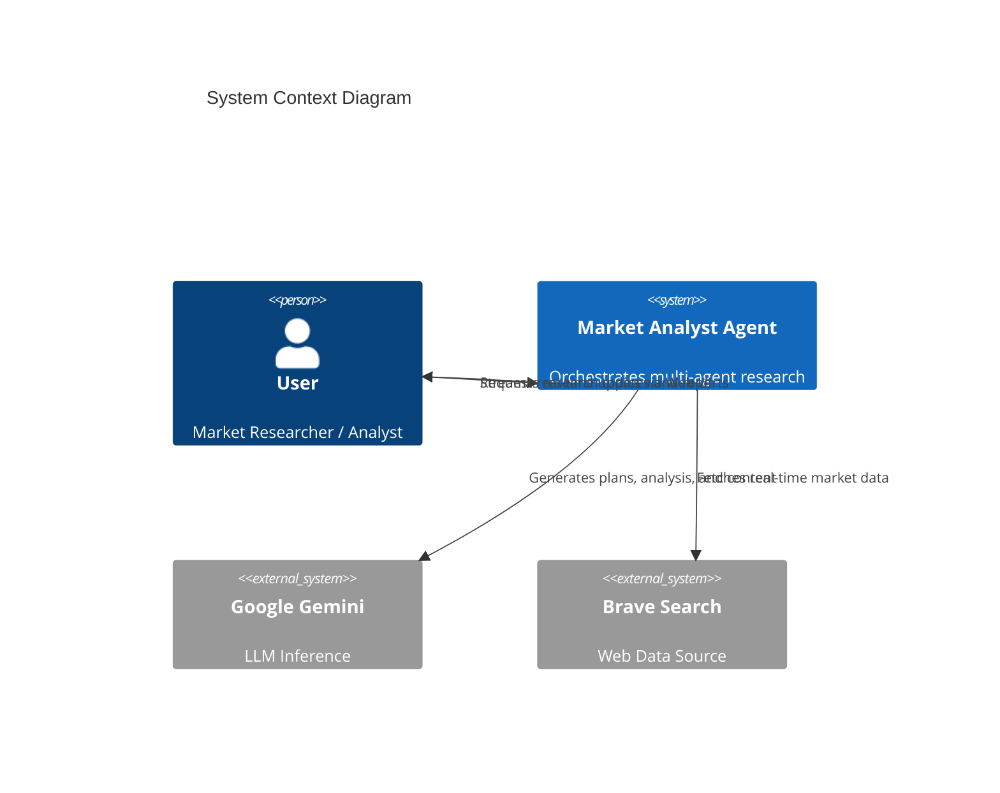
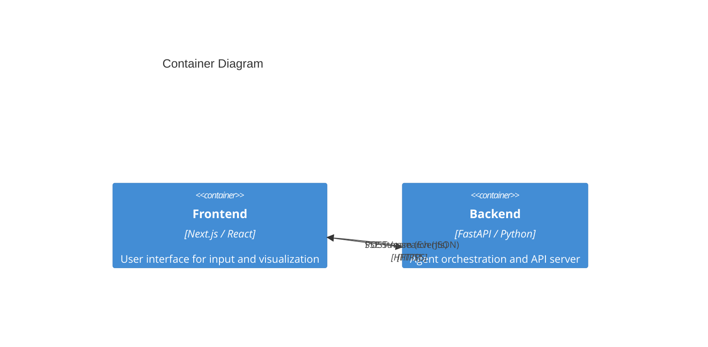
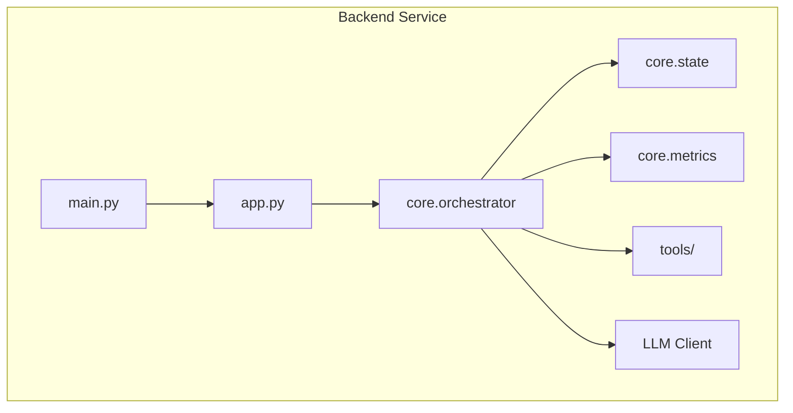

# Architecture Overview

## System Context (C4 Level 1)

The Market Analyst AI system acts as an intelligent intermediary between a user seeking market insights and the vast amount of data available on the web and through LLMs.

## Container Architecture (C4 Level 2)

The system is composed of a decoupled frontend and backend, communicating over REST and SSE.

## Component Architecture (Backend)

The backend follows a modular design focused on separation of concerns:

## Architectural Patterns

- **Modular Core**: High-level logic is separated from API glue code, enabling easier testing and extensions.
- **Orchestration Pipeline**: A coordinated linear flow (`Strategist` → `Researcher` → `Analyst` → `Synthesizer`).
- **Real-time SSE**: Bridging the gap between multi-minute research tasks and immediate user interaction.
- **Observability**: Direct integration with Prometheus metrics for tracking agent performance and API latencies.

## Key Design Decisions

1. **Synchronous Generator Pattern**:
   - **Decision**: Using Python's `AsyncGenerator` for the core loop.
   - **Rationale**: Allows natural expression of the multi-step lifecycle while yielding intermediate events to the stream.
   
2. **In-Memory State**:
   - **Decision**: `AgentState` is ephemeral.
   - **Trade-off**: Simplicity vs. Persistence. History is lost if the connection drops, but deployment is zero-dependency (no Redis/DB required).
