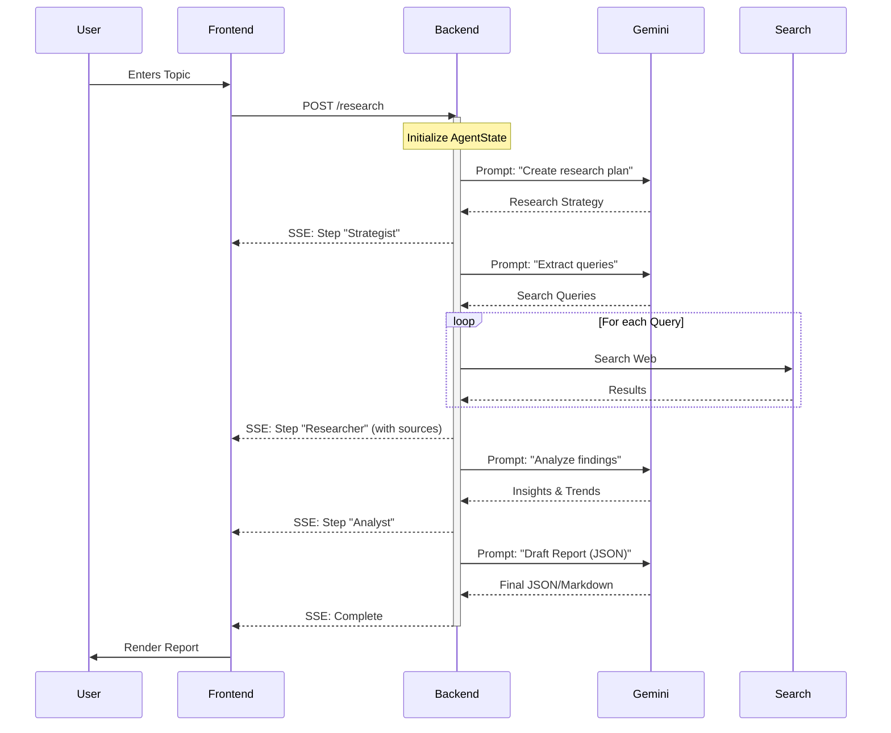
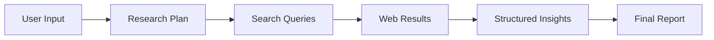

# Workflow Overview

## Core Research Pipeline

The application follows a strict 4-stage pipelines to transform a user topic into a finished report.

## Detailed Steps

### 1. Strategist
**Goal**: Deconstruct the user's request into actionable research questions.
- **Input**: Raw user topic.
- **Output**: A structured plan containing context, questions, and recommended sources.

### 2. Researcher
**Goal**: Gather grounding data from the real world.
- **Input**: Research plan.
- **Action**: Generates search queries, executes them against Brave/Tavily APIs, and aggregates results.
- **Output**: Raw textual data and citation metadata.

### 3. Analyst
**Goal**: Extract meaning from raw data.
- **Input**: Raw search results.
- **Action**: Identifies trends, computes metrics (if available), and structures the "messy" web data.
- **Output**: Synthesized insights and key metrics.

### 4. Synthesizer
**Goal**: Produce the final artifact.
- **Input**: Analyst insights.
- **Action**: Formats the content into a professional report structure, injecting JSON metadata for UI rendering.
- **Output**: Final Markdown/JSON report.

## Data Flow

